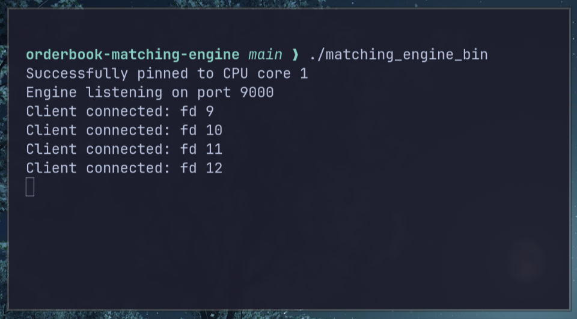
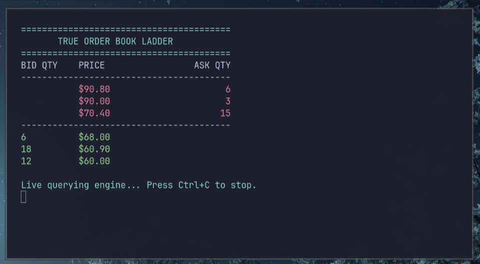
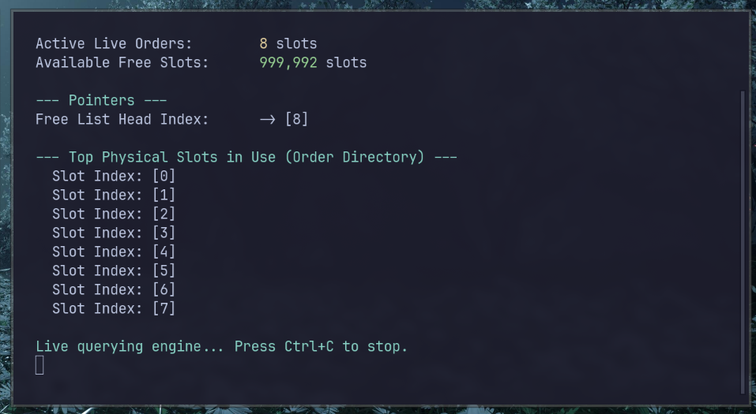
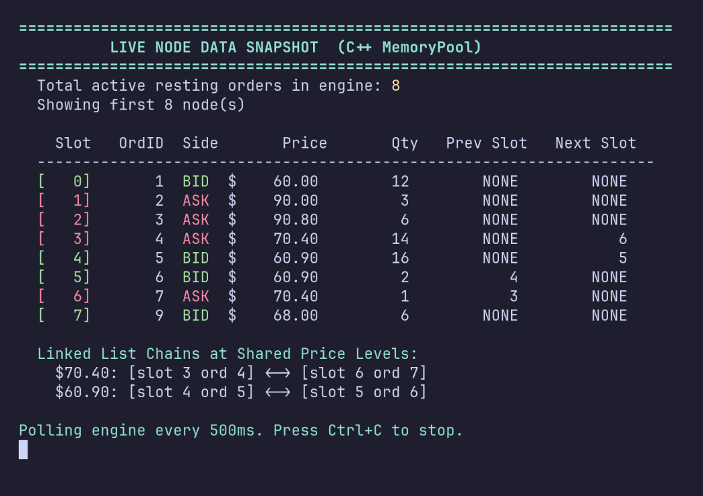
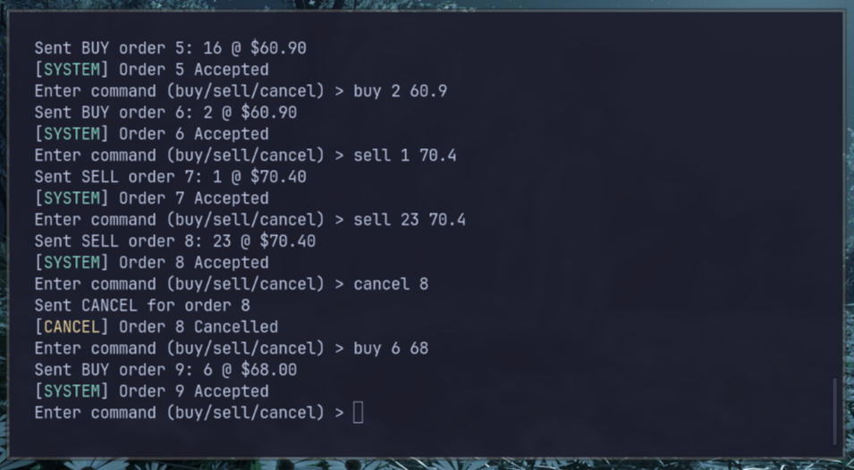

# Testing and Simulation Tools

## How the Engine and Visualizers Work Together

The matching engine is a self-contained C++ server process. When it starts, it binds TCP port 9000, creates an epoll file descriptor, and sits in an event loop waiting for connections. Every client, whether it is a trading client placing orders or a visualizer asking for a snapshot, connects to this same port and communicates using the same 14-byte binary packet format.

The engine is the single source of truth. It holds all order state in its internal memory. No client ever stores or tracks state independently. Every piece of data you see in the visualizer terminals is read directly from the engine's C++ memory at that exact moment.

## Why Visualizers Do Not Slow Down Trading

When a client sends a regular order (`type = 'N'`), the engine runs the matching logic, updates the order book, and sends execution reports. When a client sends a query (`type = 'O'`, `'M'`, or `'D'`), the engine intercepts it before the matching code ever runs, packages the requested state into a binary struct, sends it back, and skips the rest of the event handler with a `continue` statement.

The matching logic is never called for a query packet. Telemetry is never recorded for a query packet. The visualizers are invisible to the trading path.

```
Python Visualizer                    C++ Matching Engine
         |                                    |
         |  14-byte query ('O' / 'M' / 'D')  |
         | ---------------------------------> |
         |                                    |  epoll loop reads type byte
         |                                    |  type != 'N' and != 'C'
         |                                    |  -> calls snapshot function
         |                                    |  -> packs binary response
         |                                    |  -> sends it back
         |                                    |  -> continue (skips matching)
         | <---- binary snapshot response --- |
         |                                    |
         | renders to terminal                | matching loop unaffected
```

## Running All Tools Together

Start the engine first. Then open each visualizer in its own terminal. You can run all five simultaneously.

```bash
# Terminal 1: the engine (must be started first)
./matching_engine_bin

# Terminal 2: live order book ladder
python3 tests/orderbook_visualizer.py

# Terminal 3: memory pool state
python3 tests/memory_visualizer.py

# Terminal 4: raw OrderNode structs with linked list pointers
python3 tests/node_visualizer.py

# Terminal 5: place orders manually and watch every other terminal update
python3 tests/manual_client.py
```

## Tool 1: Client Simulator (`client_simulator.py`)

This script tests the engine for correctness. It sends a scripted sequence of orders and verifies that every execution report matches what price-time priority rules predict. If the engine produces a wrong fill quantity or wrong order id, the test fails immediately with a clear message.

With the `--load` flag, it instead fires 1,000 binary orders at the engine as fast as possible. This is used to populate the engine's telemetry ring buffer so you can observe meaningful latency percentiles when the engine shuts down.

```python
import struct

REQ_FMT = '<cIIIc'  # 14 bytes: char + uint32 + uint32 + uint32 + char

# Buy 100 shares at $101.00 (10100 cents)
req = struct.pack(REQ_FMT, b'N', order_id, 10100, 100, b'B')
socket.sendall(req)  # Exactly 14 bytes sent

# Read back 14-byte execution report
data = socket.recv(14)
msg_type, oid, filled_qty, fill_price, status = struct.unpack(REQ_FMT, data)
# status == b'A' means accepted, b'F' means filled
```

## Tool 2: Exchange Visualizer (`exchange_visualizer.py`)

This script acts as an automated market maker. It continuously generates random buy and sell orders around a slowly drifting mid price. As the engine matches these orders and sends back fill reports, the script renders a scrolling real-time ticker tape showing every fill: which direction it was, how many shares, and at what price.

The main thread sends orders. A background daemon thread continuously reads 14-byte execution reports from the socket and prints them as they arrive. The two threads share only the socket object, which is thread-safe for reading and writing independently.

```python
def receive_loop(s):
    while True:
        data = s.recv(14)
        if not data:
            break
        # Unpack the execution report
        r_type, order_id, filled_qty, fill_price, status = struct.unpack('<cIIIc', data)
        if status == b'F':
            print(f"FILL  order {order_id}  {filled_qty} shares at ${fill_price / 100.0:.2f}")
```

This tool is meant purely for visual demonstration. It shows the engine handling a realistic stream of mixed orders.



## Tool 3: Order Book Ladder (`orderbook_visualizer.py`)

This is a live order book ladder that reflects the true global state of the engine. It works by polling the engine with an `'O'` (orderbook) query packet every 200 milliseconds. The engine responds with a 169-byte `OrderbookSnapshot` containing the top ten bid price levels and top ten ask price levels, each with their aggregated total quantity.

Because the engine is the source, this ladder shows every resting order from every connected client at once. If you type `buy 100 100.00` in the manual client terminal, that order appears on the ladder within 200 milliseconds.

```
Python sends 14 bytes:  type='O', all other fields zero
Engine responds with 169 bytes:
  - 1 byte:  type = 'O'
  - 4 bytes: num_bids (e.g. 2)
  - 4 bytes: num_asks (e.g. 1)
  - 80 bytes: 10 bid LevelData entries (price + quantity each, 8 bytes each)
  - 80 bytes: 10 ask LevelData entries
```

```python
req = struct.pack('<cIIIc', b'O', 0, 0, 0, b'B')
socket.sendall(req)

data = recvall(socket, 169)  # Always read exactly 169 bytes
unpacked = struct.unpack('<cII40I', data)
num_bids = unpacked[1]
num_asks = unpacked[2]

for i in range(num_bids):
    price = unpacked[3 + i * 2] / 100.0   # Convert cents to dollars
    qty   = unpacked[4 + i * 2]
    print(f"BID  {qty:>10}  ${price:.2f}")
```

**What you see on screen:**

```
BID QTY       PRICE          ASK QTY
              $101.00             30
------------ spread ------------
100           $100.00
 50           $100.00
```



## Tool 4: Memory Visualizer (`memory_visualizer.py`)

This visualizer polls the engine with an `'M'` (memory) query every 500 milliseconds. The engine responds with a 49-byte `MemoryStateSnapshot` showing the internal state of the `MemoryPool`: how many orders are active, how many slots are free, where the free-list head pointer is pointing, and which physical slot indices currently contain live orders.

```
Python sends 14 bytes:  type='M', all other fields zero
Engine responds with 49 bytes:
  - 1 byte:  type = 'M'
  - 4 bytes: next_free_idx  (pool slot the next alloc() will hand out)
  - 4 bytes: total_active   (number of live resting orders right now)
  - 40 bytes: 10 slot indices currently holding live orders
```

```python
req = struct.pack('<cIIIc', b'M', 0, 0, 0, b'B')
socket.sendall(req)

data = recvall(socket, 49)
unpacked = struct.unpack('<cII10I', data)
next_free_idx = unpacked[1]
total_active  = unpacked[2]
used_slots    = unpacked[3:13]
```

**What you see on screen as you place orders:**

```
Start with empty book: Active: 0  Next free: 0
Place a buy order:     Active: 1  Next free: 1  Slot [0] in use
Place another:         Active: 2  Next free: 2  Slots [0] [1] in use
Cancel first order:    Active: 1  Next free: 0  Slot [1] in use  (slot 0 is back at top of free list)
```

This proves the zero-allocation architecture: the free-list head jumps back when an order is freed, and no OS memory calls ever happen.



## Tool 5: Node Visualizer (`node_visualizer.py`)

This is the deepest inspection tool. It polls the engine with a `'D'` (node data) query every 500 milliseconds. The engine responds with a 289-byte `NodeSnapshot` containing the full raw struct contents of up to the first ten active `OrderNode` objects in its memory pool.

Each entry shows the physical pool slot, the order id, the price, the remaining quantity, the side, and the `prev_idx` and `next_idx` linked-list pointer fields. When two orders are resting at the same price level you can watch their pointers chain together on screen.

```
Python sends 14 bytes:  type='D', all other fields zero
Engine responds with 289 bytes:
  - 1 byte:  type = 'D'
  - 4 bytes: total_active (all live orders, may be more than 10)
  - 4 bytes: num_nodes    (number of entries in this packet, max 10)
  - 280 bytes: 10 NodeData entries (28 bytes each)
    Each NodeData:
      slot_index(4) order_id(4) price(4) quantity(4) side(1) pad(3) next_idx(4) prev_idx(4)
```

```python
NODE_FMT = '<IIIIc3sII'  # 28 bytes per node
HDR_FMT  = '<cII'        # 9 bytes header

req = struct.pack('<cIIIc', b'D', 0, 0, 0, b'B')
socket.sendall(req)

data = recvall(socket, 289)
msg_type, total_active, num_nodes = struct.unpack_from(HDR_FMT, data, 0)
for i in range(num_nodes):
    slot, oid, price, qty, side_b, _, next_idx, prev_idx = struct.unpack_from(NODE_FMT, data, 9 + i * 28)
```

**Example: you placed two buys at $100.00 and one sell at $101.00**

```
  Slot  OrdID  Side      Price       Qty   Prev Slot  Next Slot
  [  0]     1   BID   $100.00       100        NONE          1
  [  1]     2   BID   $100.00        50           0       NONE
  [  2]     3   ASK   $101.00        30        NONE       NONE

  Linked List at $100.00:
    [slot 0 ord 1] <-> [slot 1 ord 2]
```

Slot 0 is the head of the $100.00 price level. Its `next_idx` is 1, meaning the node in pool slot 1 is queued behind it. Slot 1's `prev_idx` is 0, pointing back to slot 0. If Charlie now sends a buy for 150 shares at $100.00, the engine matches slot 0 (100 shares) first, then slot 1 (50 shares remaining after 50 are filled).



## Tool 6: Manual Client (`manual_client.py`)

An interactive command-line client for placing real orders into the live engine. A background thread reads execution reports and prints them above your prompt asynchronously so you can keep typing while fills arrive.

```
=== Manual Trading Client ===
  buy <qty> <price>    e.g. buy 100 101.50
  sell <qty> <price>   e.g. sell 50 102.00
  cancel <order_id>    e.g. cancel 1

Enter command > buy 100 100.00
Sent BUY order 1: 100 @ $100.00
[SYSTEM] Order 1 Accepted
Enter command > sell 60 100.00
Sent SELL order 2: 60 @ $100.00
[SYSTEM] Order 2 Accepted
[FILL] Order 1 filled 60 shares at $100.00
[FILL] Order 2 filled 60 shares at $100.00
Enter command >
```

At the moment the FILL reports appear, the order book ladder shows Order 1 reduced from 100 to 40 shares, and the memory visualizer shows 1 slot freed (Order 2 was fully consumed).


